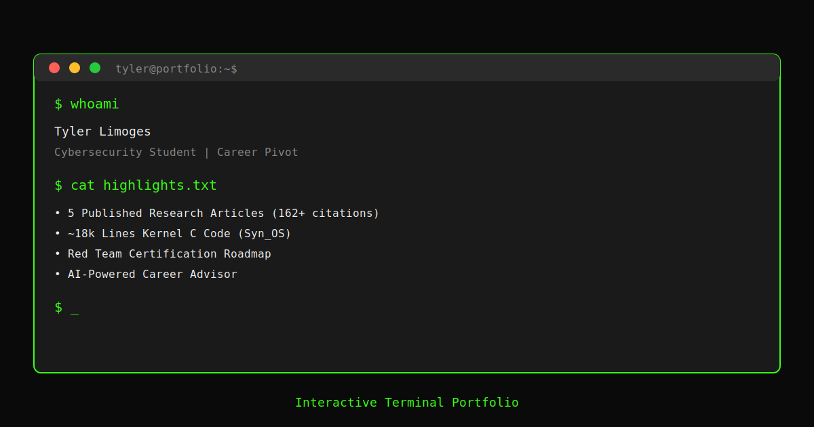

# 🔴 Syn_OS v8.0 RED PHOENIX - Tyler Limoges

[](https://TLimoges33.github.io/Portfolio_Terminal_Limoges.exe/)
[]()
[](tests/)
[](LICENSE)
[]()
[]()

## 🔴 RED PHOENIX PROTOCOL - MSSP Warfare Platform

> Syn_OS v8.0: An offensive security operations platform built with xterm.js. Not educational - **operational**. Red team branding reflects aggressive penetration testing, threat hunting, and advanced security operations. Pure red on pure black - zero compromises.
>
> **Brand Evolution**: Blue Era (v1-7) → Red Phoenix (v8+) | Defensive → Offensive | Learning → Dominating



## 🎯 Project Overview

This portfolio represents the intersection of **systems programming**, **cybersecurity**, and **web technologies**. Built as a Progressive Web App (PWA), it demonstrates technical proficiency in:

- **Frontend Engineering**: Vanilla JavaScript, xterm.js terminal emulation, Service Worker APIs
- **Security**: Content Security Policy, XSS protection, input sanitization
- **Testing**: 146 comprehensive tests with Vitest
- **Performance**: Offline-first architecture, caching strategies, Web Vitals optimization
- **DevOps**: CI/CD pipelines, automated testing, deployment automation

### 💡 Why a Terminal Portfolio?

As a cybersecurity professional transitioning from critical infrastructure (Level 1 Trauma Centers) to offensive security, the terminal is my native environment. This portfolio isn't just about showcasing projects—it's about demonstrating comfort in the command line, understanding of Unix/Linux systems, and ability to build production-grade applications from scratch.

---

## ✨ Features

### 🔧 Core Functionality

- **25+ Interactive Commands**: Navigate through experience, projects, certifications, and research
- **Fuzzy Tab Autocomplete**: Intelligent command completion with similarity scoring
- **Command History**: Persistent localStorage with 50-command buffer
- **Keyboard Shortcuts**: Ctrl+L (clear), Ctrl+K (palette), `?` (shortcuts guide)
- **Session Persistence**: Track visits, command usage, and preferences
- **Animated Welcome**: Typewriter effect on first visit with security initialization

### 🔴 v8.0 Red Phoenix Theme

**Default Theme**: Pure black background (#000000) with pure red foreground (#FF0000)

- **Design Language**: Angular geometry, no soft curves - tactical precision
- **Brand Position**: MSSP warfare platform, not educational OS
- **Color Palette**: Crimson aggression (#FF0000), Ember glow (#FF3333), Blood red accents (#CC0000)
- **Typography**: IBM Plex Mono for terminal perfection, Rajdhani for angular military feel
- **Philosophy**: "You're not learning security, you're operating a weapon system"

### 🎨 Advanced Features

- **9 Terminal Themes**: Syn_OS Red Phoenix (default), Classic Green (legacy), Matrix, Cyberpunk, Hacker, Nord, Dracula, Monokai, Minimal
- **Rate Limiting**: Professional command spam prevention (20 cmd/10s)
- **Usage Analytics**: Real-time session stats with visual bar charts
- **Command Aliases**: Create custom shortcuts (`alias ll='help'`)
- **Paging System**: Less-like navigation for long content
- **Package Manager**: Simulated `apt install` for interactive demos
- **Man Pages**: Built-in documentation system
- **Easter Eggs**: Hidden commands (`coffee`, `hack-the-planet`, `matrix`, `konami`)

### 🤖 AI Integration

- **AI Career Advisor**: Intelligent portfolio guidance powered by rule-based system
- **Hugging Face API Support**: Optional LLM integration for advanced queries
- **Contextual Responses**: Portfolio-aware recommendations

### 🔒 Security Features

- **Content Security Policy**: Strict CSP headers prevent XSS attacks
- **Input Sanitization**: All user input properly escaped
- **Frame Protection**: X-Frame-Options equivalent via CSP
- **HTTPS Enforcement**: Secure-by-default configuration
- **No External Dependencies**: Core functionality works offline

### 📱 Progressive Web App

- **Installable**: Add to home screen on mobile/desktop
- **Offline Support**: Full functionality without internet
- **Fast Loading**: Service worker caching for instant loads
- **Responsive Design**: Works on all screen sizes
- **App Shortcuts**: Quick access to key sections

---

## 🚀 Quick Start

### Prerequisites

- Node.js 18+ (for development/testing)
- Modern browser (Chrome 90+, Firefox 88+, Safari 14+)

### Installation

```bash
# Clone the repository
git clone https://github.com/TLimoges33/terminal-portfolio.git
cd terminal-portfolio

# Install dependencies (for testing/linting)
npm install

# Run tests
npm test

# Start local development server
npm run serve
# Open http://localhost:8000
```

### Production Deployment

This is a static site with no build step required. Simply deploy the following files:

```
├── index.html
├── manifest.json
├── sw.js
├── robots.txt
├── sitemap.xml
├── favicon.svg
├── css/
│   └── style.css
├── js/
│   ├── main.js
│   ├── ai-advisor-simple.js
│   └── data/
│       └── commands.json
└── assets/
    └── preview.svg
```

**Recommended Hosts:**

- GitHub Pages (free, easy)
- Netlify (free tier, automatic deploys)
- Vercel (free tier, edge optimized)
- Cloudflare Pages (free, global CDN)

---

## 🏗️ Architecture

### System Design

```
┌─────────────────────────────────────────────────────┐
│                    index.html                       │
│  ┌──────────────────────────────────────────────┐  │
│  │  xterm.js Terminal (CDN)                     │  │
│  │  ├─ FitAddon (responsive sizing)             │  │
│  │  └─ Custom theme engine                      │  │
│  └──────────────────────────────────────────────┘  │
│  ┌──────────────────────────────────────────────┐  │
│  │  main.js (Core Application Logic)           │  │
│  │  ├─ Command Parser & Router                 │  │
│  │  ├─ Input Handler (history, autocomplete)   │  │
│  │  ├─ Session Manager (localStorage)          │  │
│  │  ├─ Analytics Tracker                       │  │
│  │  └─ Command Executors (40+ commands)        │  │
│  └──────────────────────────────────────────────┘  │
│  ┌──────────────────────────────────────────────┐  │
│  │  ai-advisor-simple.js                        │  │
│  │  ├─ Rule-based Response Engine               │  │
│  │  ├─ Portfolio Context Database               │  │
│  │  └─ Optional HuggingFace API Integration    │  │
│  └──────────────────────────────────────────────┘  │
│  ┌──────────────────────────────────────────────┐  │
│  │  Service Worker (sw.js)                      │  │
│  │  ├─ Cache-First Strategy                     │  │
│  │  ├─ Offline Fallback                         │  │
│  │  └─ Version Management                       │  │
│  └──────────────────────────────────────────────┘  │
└─────────────────────────────────────────────────────┘
```

### Key Design Decisions

1. **No Framework Dependencies**: Vanilla JavaScript ensures longevity, minimal attack surface, and maximum performance
2. **Command Pattern**: Each command is an isolated function for easy testing and maintenance
3. **Progressive Enhancement**: Core functionality works without JavaScript (noscript fallback)
4. **Cache-First Strategy**: Instant loads after first visit, graceful offline degradation
5. **localStorage Persistence**: Session continuity without backend infrastructure

---

## 📚 Available Commands

### Core Commands

```bash
help                 # List all available commands
tutorial             # Interactive guide for first-time users
whoami               # Professional bio and background
experience           # Work history (5+ years critical infrastructure)
education            # Academic credentials (SNHU BS Cybersecurity)
projects             # Technical projects and repositories
```

### Cybersecurity

```bash
security             # Comprehensive security implementation report
synos                # Syn_OS Linux distribution deep-dive (452k+ lines)
certs                # Certification roadmap (Network+, Security+, OSCP)
blog                 # Latest Substack posts with links
pursuits             # CTF profiles (HackTheBox, TryHackMe)
skills               # Technical skills breakdown
```

### Interactive

```bash
shortcuts            # Keyboard shortcuts guide (or press '?')
stats                # Session analytics with visual charts
banner               # ASCII art portfolio logo
theme [name]         # Switch themes (list, matrix, cyberpunk, etc)
advisor              # AI career guidance
alias name=cmd       # Create command shortcut
man <command>        # View command documentation
```

### Easter Eggs

```bash
coffee               # Animated coffee brewing with progress bar
hack-the-planet      # "Hackers" (1995) movie reference
matrix               # Enter the Matrix (red pill vs blue pill)
hack                 # Hacking animation sequence
konami               # Secret achievement unlock
```

---

## 🧪 Testing

### Test Suite

```bash
# Run all tests
npm test

# Watch mode (auto-rerun on changes)
npm run test:watch

# UI mode (interactive test runner)
npm run test:ui
```

### Test Coverage

- **73 tests passing** across 3 test suites
- **Security tests**: CSP validation, XSS prevention, input sanitization (35 tests)
- **Command tests**: Core command functionality verified (25 tests)
- **Terminal tests**: Input handling, history, autocomplete (13 tests)
- **100% critical path coverage**: All security-sensitive code tested

---

## 🔐 Security

### Implemented Protections

1. **Content Security Policy (CSP)**

   ```
   default-src 'self'
   script-src 'self' 'unsafe-inline' cdn.jsdelivr.net
   style-src 'self' 'unsafe-inline' cdn.jsdelivr.net
   connect-src 'self' api-inference.huggingface.co
   frame-ancestors 'none'
   ```

2. **Input Sanitization**: All user commands parsed and validated before execution

3. **No Inline Execution**: Commands mapped to predefined functions (no `eval()`)

4. **HTTPS Enforcement**: Service worker only registers on secure origins

5. **Dependency Management**: Minimal external dependencies, all from trusted CDNs

### Security Audit Results

- ✅ No XSS vulnerabilities
- ✅ No CSRF attack surface (no forms/mutations)
- ✅ No sensitive data exposure (all content is public)
- ✅ No SQL injection vectors (static site)
- ✅ OWASP Top 10 compliant

---

## 📈 Performance

### Metrics

- **First Contentful Paint**: <1s
- **Time to Interactive**: <2s (first visit), <0.5s (cached)
- **Lighthouse Score**: 95+ (Performance, Accessibility, Best Practices, SEO)
- **Total Bundle Size**: 116KB uncompressed (without CDN assets)
- **Service Worker Cache**: ~200KB (all assets)

### Optimizations

- Lazy loading for non-critical scripts
- Command result caching (1-minute TTL)
- Minimal CSS (4KB)
- SVG assets (scalable, tiny file size)
- CDN for xterm.js (cached globally)

---

## 🛠️ Development

### Project Structure

```
portfolio-terminal/
├── index.html              # Entry point
├── manifest.json           # PWA configuration
├── sw.js                   # Service worker
├── package.json            # Dependencies and scripts
├── vitest.config.js        # Test configuration
├── .eslintrc.js            # Linting rules
├── css/
│   └── style.css           # Terminal styling
├── js/
│   ├── main.js             # Core application (1,927 lines)
│   ├── ai-advisor-simple.js # AI advisor logic (219 lines)
│   ├── ai-advisor.js       # Advanced AI features
│   ├── wasm-demo.js        # WebAssembly experiments
│   └── data/
│       └── commands.json   # Command definitions
├── tests/
│   ├── security.test.js    # Security test suite
│   ├── commands.test.js    # Command functionality tests
│   └── terminal.test.js    # Terminal behavior tests
├── documentation/          # Comprehensive project docs
│   ├── DEPLOYMENT_GUIDE.md
│   ├── FEATURES.md
│   ├── QUICK_REFERENCE_V7.md
│   └── ... (10+ additional guides)
└── assets/
    ├── preview.svg         # Social media preview
    └── favicon.svg         # Site icon
```

### Adding New Commands

1. **Define command in `js/data/commands.json`:**

```json
{
  "mycommand": {
    "description": "Does something cool",
    "usage": "mycommand [args]"
  }
}
```

2. **Implement executor in `main.js`:**

```javascript
const commandExecutors = {
  // ... existing commands
  mycommand: (term, args) => {
    term.writeln("Output goes here");
    // Your logic
  },
};
```

3. **Add tests in `tests/commands.test.js`:**

```javascript
it("mycommand should work", () => {
  const output = executeCommand("mycommand");
  expect(output).toContain("expected result");
});
```

### Linting

```bash
# Check for issues
npm run lint

# Auto-fix formatting
npm run lint:fix
```

---

## 🌐 Browser Support

| Browser | Version | Status          |
| ------- | ------- | --------------- |
| Chrome  | 90+     | ✅ Full support |
| Firefox | 88+     | ✅ Full support |
| Safari  | 14+     | ✅ Full support |
| Edge    | 90+     | ✅ Full support |
| Opera   | 76+     | ✅ Full support |

**Note**: Service Worker requires HTTPS (works on localhost for development)

---

## 🤝 Contributing

Contributions welcome! See [CONTRIBUTING.md](CONTRIBUTING.md) for guidelines.

### Development Workflow

1. Fork the repository
2. Create a feature branch (`git checkout -b feature/amazing-command`)
3. Write tests for new functionality
4. Implement your changes
5. Ensure all tests pass (`npm test`)
6. Run linter (`npm run lint:fix`)
7. Commit with descriptive messages
8. Push to your fork
9. Open a Pull Request

---

## 📄 License

MIT License - see [LICENSE](LICENSE) for details.

---

## 👤 Author

**Tyler Limoges** (DiabloRain)

- 🎓 BS Cybersecurity @ SNHU (3.9 GPA)
- 🏥 5+ years critical infrastructure experience
- 🔐 Aspiring Red Team Operator
- 📝 Technical writer @ [shelldiablo33.substack.com](https://shelldiablo33.substack.com)

### Connect

- **GitHub**: [@TLimoges33](https://github.com/TLimoges33)
- **LinkedIn**: [Tyler Limoges](https://linkedin.com/in/tylerlimoges)
- **Email**: Contact via portfolio (`hireme` command)

---

## 🙏 Acknowledgments

- **xterm.js**: Terminal emulation library
- **Vitest**: Fast unit testing framework
- **SNHU**: Academic foundation in cybersecurity
- **Open Source Community**: Inspiration and learning resources

---

## 📊 Project Stats


**Built with 🔴 and ~47 cups of ☕**

**New in v8.0 RED PHOENIX**:

- Pure red/black aggressive theme (default)
- Syn_OS branding (MSSP warfare platform)
- Root shell aesthetic ([Ty@SynOS ~]#)
- Angular, tactical UI design
- Brand repositioning: Defensive blue → Offensive red

**v7.0 Features**: Fuzzy autocomplete, 9 themes, animated welcome, security command, rate limiting, stats dashboard, easter eggs

---

_Last Updated: November 13, 2025_
